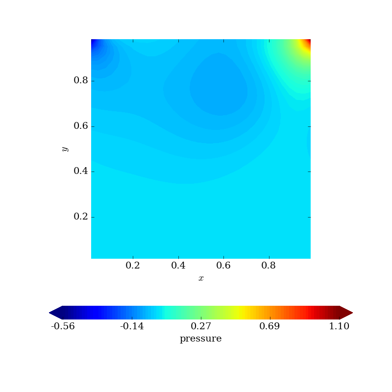
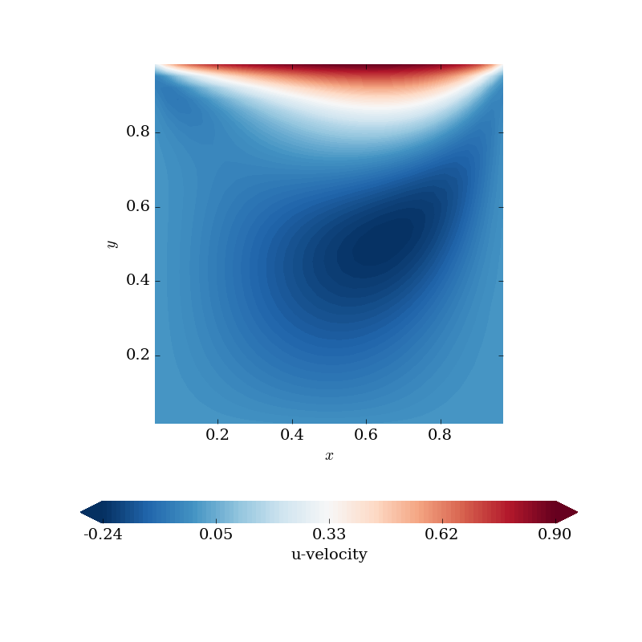
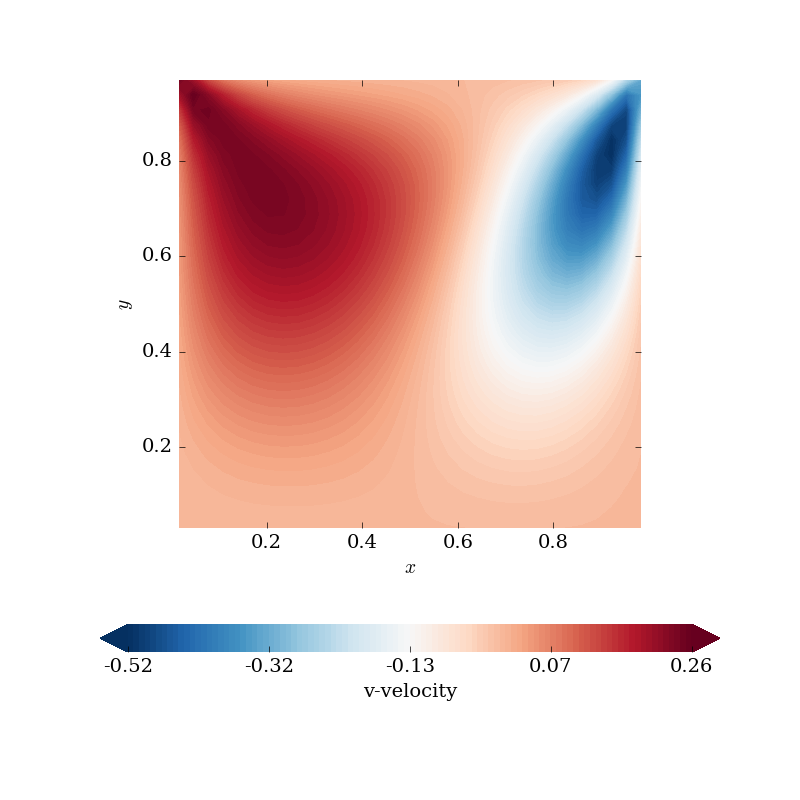
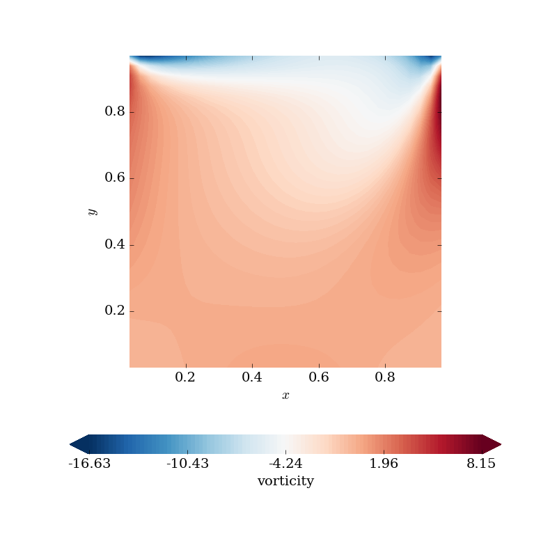
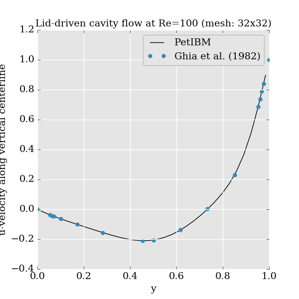
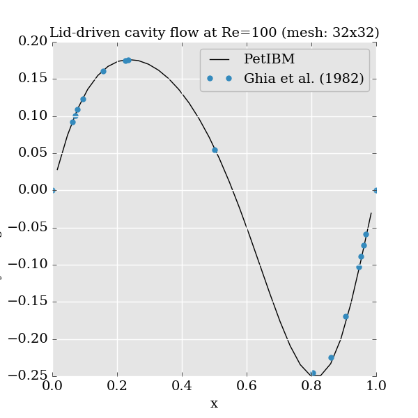
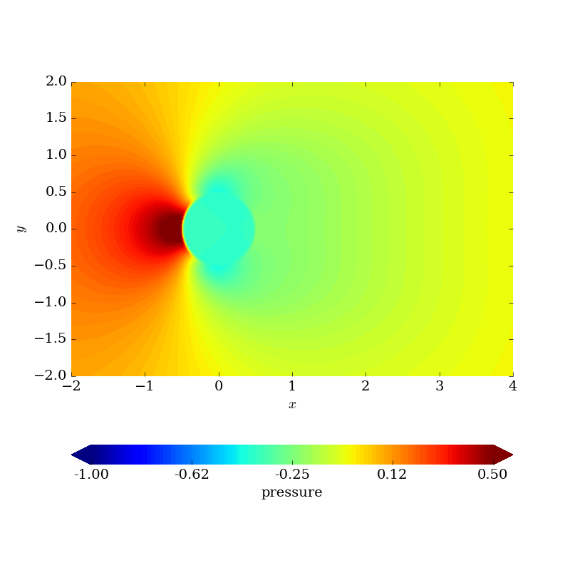
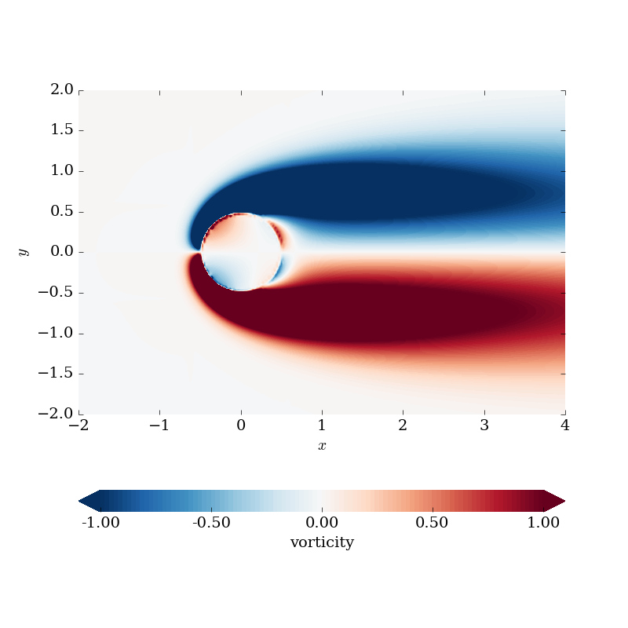

## 2D lid-driven cavity flow at Re=100

The input files for this example are located in the directory `$PETIBM_DIR/examples/2d/lidDrivenCavity/Re100`.

The fluid, with kinematic viscosity `0.01` is enclosed in a two-dimensional box that spans `[0.0, 1.0]` in both directions. All solid walls are fixed except the top one that moves in the x-direction at velocity speed `1.0`. The Reynolds number of the flow, based on the box-length and the top-wall speed, is `100`. The fluid is initially at rest and the top-wall impulsively starts moving.

The computational domains discretized using a uniform `32x32` Cartesian grid.  We choose a time-increment of `0.02`.

To run the case in parallel using `1` MPI process, change directory to your PetIBM build directory, then:

    cd examples
    make examples
    make lidDrivenCavity2dRe100Serial

The program runs for `2000` time-steps, and saves the numerical solution at the final time-step (at which we consider the flow to have reach a steady-state).

We may now post-process the results:

    python $PETIBM_DIR/scripts/python/plotFields2d.py \
        --directory 2d/lidDrivenCavity/Re100

The command-line above, generates the contours of the velocity components, the pressure field and the vorticity field after `2000` time-steps. The figures are saved as `.png` files in the sub-folder `images` of the simulation directory.

We have also a Python script to compare the velocity at mid-cavity with numerical data from Ghia et al. (1982).

    python $PETIBM_DIR/scripts/python/verification/cavityCenterlines.py \
        --directory 2d/lidDrivenCavity/Re100 \
        --Re 100

The script plots the horizontal velocity along a vertical gridline at mid-cavity and the the vertical velocity along an horizontal gridline at mid-cavity.
The figures are saved as `.png` files in the sub-folder `images` of the simulation directory.

Here are the figures we obtained:

## 2D flow over a circular cylinder at Re=40

A circular cylinder of diameter `1.0` is placed at the center of a two-dimensional domain spanning `[-15,15]x[-15,15]`. The initial velocity of the fluid in the domain is `(1, 0)`. Dirichlet boundary conditions for the velocity are on all edges (velocity set to `(1.0, 0.0)`), except at the outlet where a the fluid is convective outside the domain in the x-direction at speed `1.0`. The Reynolds number, based on the freestream speed and the diameter of the circular cylinder, is `40`.

The computational domain is discretized using an stretched grid with `186x186` cells. The uniform region consists of the box `[-0.6, 0.6]x[-0.6, 0.6]` that contains `48x48` cells, giving a grid-resolution of `0.025` in both directions. Then, a stretching-ratio of `1.05` is applied in all directions from the edges of the uniform region to the domain limits.

We run the simulation for `2000` time-steps with time-increment of `0.01`, saving the numerical solution every `500` iterations.

To run this example using `2` MPI processes, navigate to your PetIBM build directory, then:

    cd examples
    make examples
    make cylinder2dRe40

You may now post-process the results:

    python $PETIBM_DIR/scripts/python/plotFields2d.py \
        --directory 2d/cylinder/Re40 \
        --bottom-left -2.0 -2.0 \
        --top-right 4.0 2.0 \
        --no-velocity \
        --pressure-range -1.0 0.5 101 \
        --vorticity-range -1.0 1.0 101

The command-line above generates the contours within the box `[-2.0, 4.0]x[-2.0, 2.0]` of the pressure field, the vorticity field (between `-1.0` and `1.0` using `101` contours), excluding the velocity fields, at each time-step saved.

Here are the figures we obtained after `2000` time-steps of flow simulation:

### Optional: using a GPU to solve the Poisson system with AmgX

If you have built PetIBM with AmgXWrapper, here are the command-lines to use to solve the same problem except that the Poisson system is now solved on a single CUDA-capable GPU device:

    cd examples
    make examples
    export LD_LIBRARY_PATH="$LD_LIBRARY_PATH:<path-to-amgx-lib>"
    export CUDA_VISIBLE_DEVICES=0
    make cylinder2dRe40GPU

For example, if AmgX is located in the directory `$HOME/src`, replace `<path-to-amgx-lib>` with `$HOME/src/amgx/lib`.

Here, we are using a single GPU denoted by index `0`.

To plot the vorticity contours after 2000 time-steps, use the following command-line:

    python $PETIBM_DIR/scripts/python/plotFields2d.py \
        --directory GPU/2d/cylinder/Re40 \
        --bottom-left -2.0 -2.0 \
        --top-right 4.0 2.0 \
        --no-velocity \
        --pressure-range -1.0 0.5 101 \
        --vorticity-range -1.0 1.0 101
