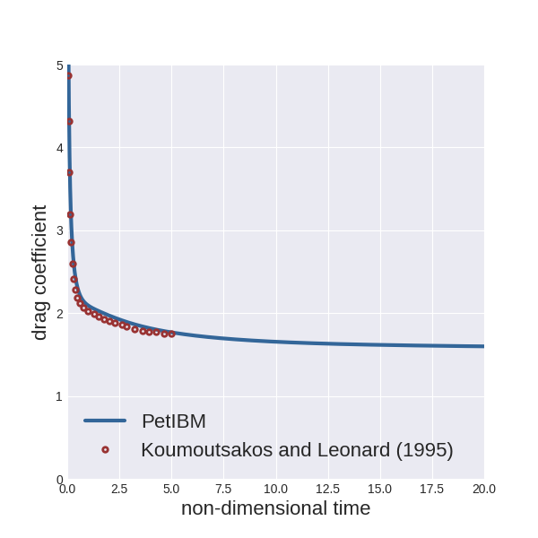
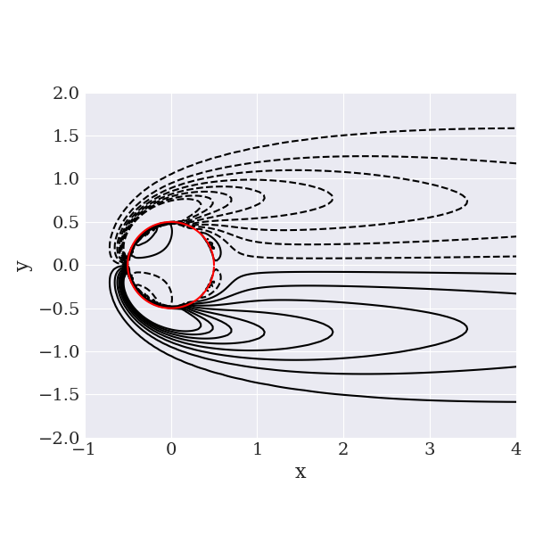
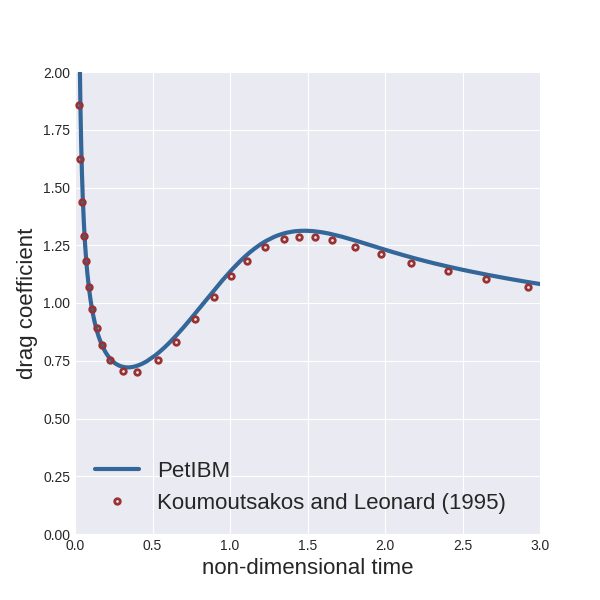
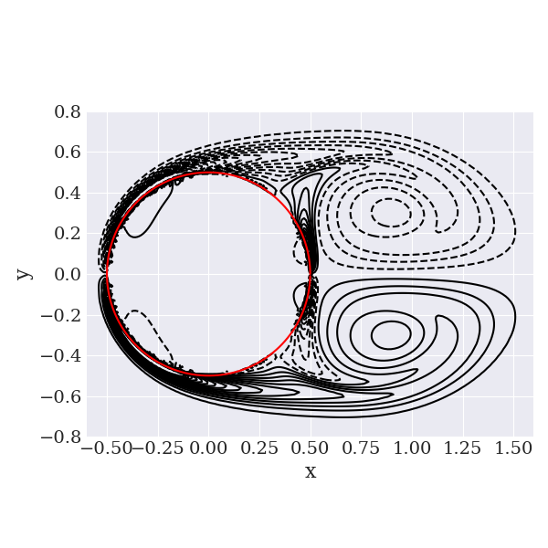

# 2D examples

## 2D lid-driven cavity flow at Re=100

Input files are located in the folder `examples/navierstokes/liddrivencavity2dRe100` of the PetIBM directory.

Make sure that the PetIBM executables are available in your PATH environment variable.
To add the PetIBM installation directory to you PATH:

    export PATH:<petibm-installation-directory>:$PATH

We are going to solve the flow in a 2D square cavity of unit length with the top wall moving in the positive x direction at speed 1.
The Reynolds number (based on the kinematic viscosity, the length of the cavity, and the speed of the moving wall) is 100.
The fluid is initially at rest and the top wall impulsively starts moving.

The computational domain [0, 1]x[0, 1] is uniformly discretized with 32 cells in each direction.

We will run 1000 time steps with a time increment of 0.01 and save the numerical solution at the end.

To run this example:

    cd <simulation-directory>
    petibm-navierstokes

The simulation should completes within few seconds.

The numerical solution is saved in the sub-folder `solution`.

We provide a Python script to visualize the velocity components along the centerlines and compare with the numerical results from Ghia et al. (1982).
To access the data for comparison you will need to set the environment variable `PETIBM_EXAMPLES` as the root directory of the PetIBM examples (for example, `export PETIBM_EXAMPLES=$PETIBM_DIR/examples`).
To run the script:

    python <simulation-directory>/scripts/plotCenterlineVelocities.py

The plot will be saved as a PNG file in the folder `figures` of the simulation directory.

Here is what we obtained:

You can also create XDMF files for the field variables (pressure and velocity components) with

    cd <simulation-directory>
    petibm-createxdmf

To compute the 2D vorticity field, use:

    cd <simulation-directory>
    petibm-vorticity

## 2D flow over a circular cylinder at Re=40

Input files are located in the folder `examples/ibpm/cylinder2dRe40` of the PetIBM directory.

Make sure that the PetIBM executables are available in your PATH environment variable.
To add the PetIBM installation directory to you PATH:

    export PATH:<petibm-installation-directory>:$PATH

A circular cylinder of diameter 1.0 is placed at the center of a two-dimensional domain spanning [-15,15]x[-15,15].
The initial velocity of the fluid in the domain is (1, 0).
Dirichlet conditions for the velocity are set on all boundaries (velocity set to (1, 0)), except at the outlet where the fluid is convected outside the domain in the x-direction at speed 1.0.
The Reynolds number (based on the freestream speed, the diameter of the circular cylinder, and the kinematic viscosity) is 40.

The computational domain is discretized using an stretched Cartesian grid with 186x186 cells.
The mesh is kept uniform in the sub-domain [-0.6, 0.6]x[-0.6, 0.6] and stretched to the external boundaries with a constant ratio of 1.05.

We will run the simulation with the immersed-boundary projection method for 2000 time steps with a time increment of 0.01 and save the numerical solution at the end.

To run the example using 2 MPI processes:

    cd <simulation-directory>
    mpiexec -np 2 petibm-tairacolonius

The run should complete in less than 5 minutes and the numerical solution is saved in the folder `solution`.

We provide a Python script (located under the folder `scripts` in the simulation directory) to plot the instantaneous drag coefficient and compare it with the numerical results from Koumoutsakos and Leonard (1995).
To run the script:

    python <simulation-directory>/scripts/plotDragCoefficient.py

To compute the 2D vorticity field, use:

    cd <simulation-directory>
    petibm-vorticity

We also provide a Python script to plot the vorticity field and save it in the folder `figures` in the simulation directory:

    python <simulation-directory>/scripts/plotVorticity.py

Here is what we obtained:

## 2D flow over a circular cylinder at Re=550 (using AmgX)

Input files are located in the folder `examples/ibpm/cylinder2dRe550_GPU` of the PetIBM directory.

Make sure that the PetIBM executables are available in your PATH environment variable.
To add the PetIBM installation directory to you PATH:

    export PATH:<petibm-installation-directory>:$PATH

A circular cylinder of diameter 1.0 is placed at the center of a two-dimensional domain spanning [-15,15]x[-15,15].
The initial velocity of the fluid in the domain is (1, 0).
Dirichlet conditions for the velocity are set on all boundaries (velocity set to (1, 0)), except at the outlet where the fluid is convected outside the domain in the x-direction at speed 1.0.
The Reynolds number (based on the freestream speed, the diameter of the circular cylinder, and the kinematic viscosity) is 550.

The computational domain is discretized using an stretched Cartesian grid with 450x450 cells.
The mesh is kept uniform in the sub-domain [-0.54, 0.54]x[-0.54, 0.54] and stretched to the external boundaries with a constant ratio of 1.02.

We will run the simulation with the immersed-boundary projection method for 1200 time steps with a time increment of 0.0025 and save the numerical solution at the end.

To run the example using 2 MPI processes and 1 CUDA-capable GPU device:

    cd <simulation-directory>
    export CUDA_VISIBLE_DEVICES=0
    mpiexec -np 2 petibm-tairacolonius

The run should complete in less than 5 minutes (with a NVIDIA K40 GPU device) and the numerical solution is saved in the folder `solution`.

We provide a Python script (located under the folder `scripts` in the simulation directory) to plot the instantaneous drag coefficient and compare it with the numerical results from Koumoutsakos and Leonard (1995).
To run the script:

    python <simulation-directory>/scripts/plotDragCoefficient.py

To compute the 2D vorticity field, use:

    cd <simulation-directory>
    petibm-vorticity

We also provide a Python script to plot the vorticity field and save it in the folder `figures` in the simulation directory:

    python <simulation-directory>/scripts/plotVorticity.py

Here is what we obtained:

## References

* Ghia, U. K. N. G., Ghia, K. N., & Shin, C. T. (1982). High-Re solutions for incompressible flow using the Navier-Stokes equations and a multigrid method. Journal of computational physics, 48(3), 387-411.
* Koumoutsakos, P., & Leonard, A. (1995). High-resolution simulations of the flow around an impulsively started cylinder using vortex methods. Journal of Fluid Mechanics, 296, 1-38.
