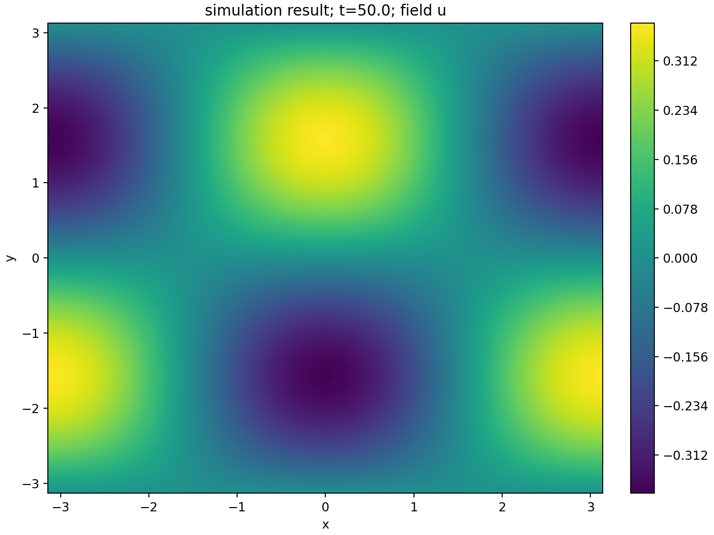
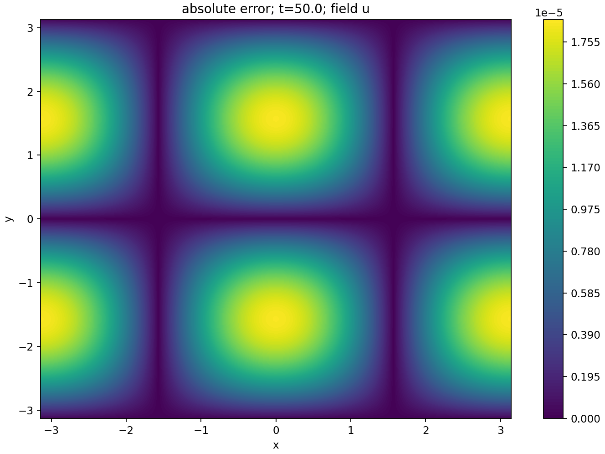
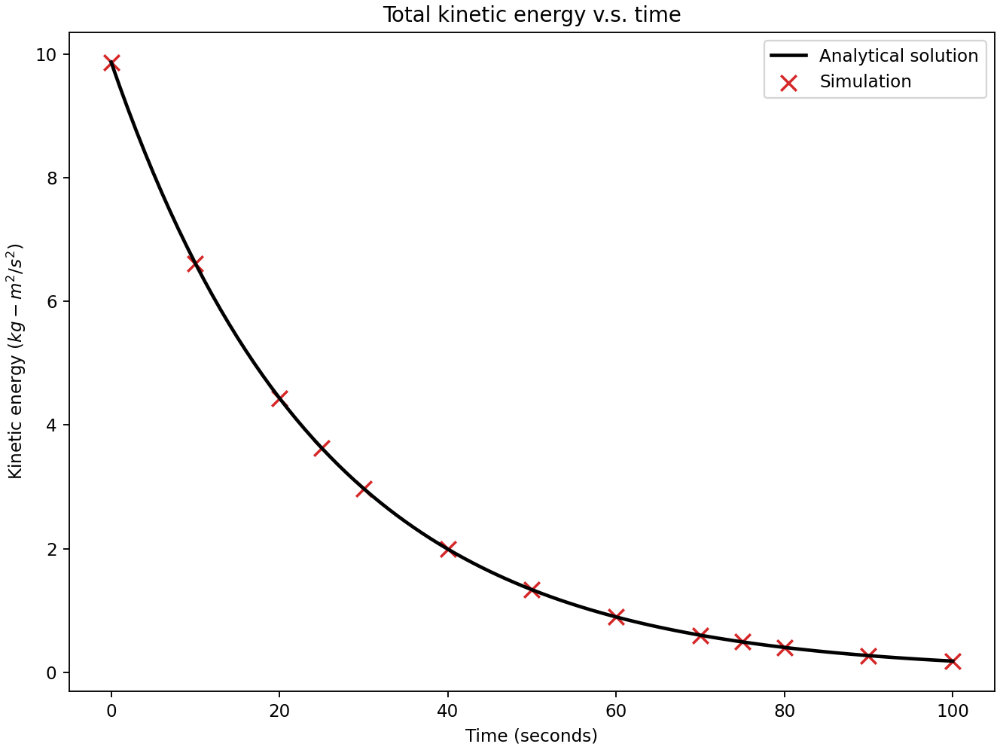

# 2D Taylor-Green vortex w/ Re=100

This example shows how to use symbolic expressions as initial conditions.

To run this example, do

```shell
$ mpiexec -n <number of processes> petibm-navierstokes
```

It should take less than 4 minutes with 6 CPU cores of Intel i7-5930K.

Once the simulation is done, run the following command for post-processing (assuming required Python packages were installed):

```shell
$ python postprocessing.py
```

**Results**

- U velocity contour at t=50
  
- Absolute error of U velocity at t=50
  
- Total kinetic energy
  
