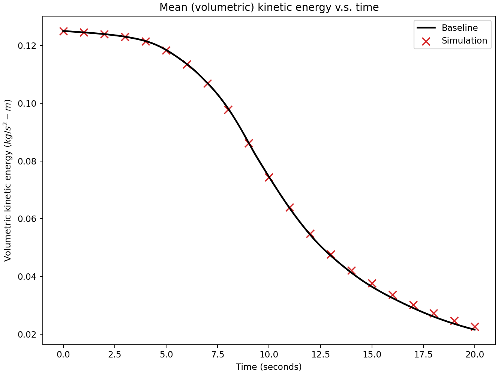
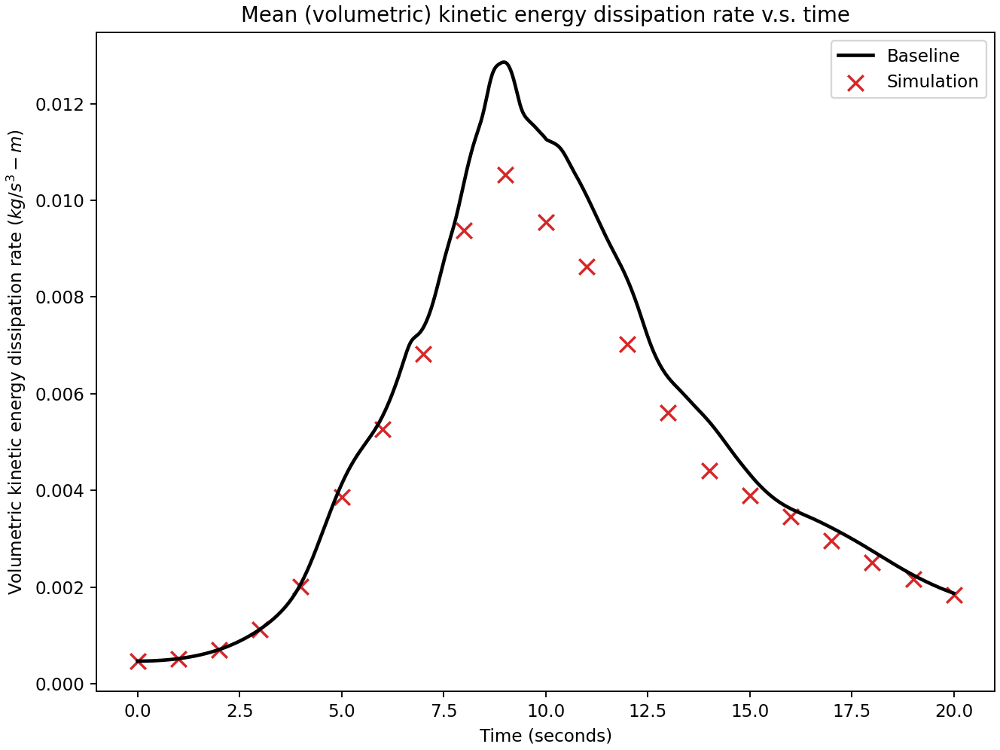

# 3D Taylor-Green vortex w/ Re=1600

This is a standard benchmark case for testing CFD solvers.
Please see the test case C3.5 in reference [1] for the [problem setup](https://cfd.ku.edu/hiocfd/case_c3.5.pdf) and [reference data](https://cfd.ku.edu/hiocfd/data.tgz).
We also keep a copy of reference data in the folder `resources`.

The results shown later are not using fine enough grid because our purpose is to provide an example for:

1. using GPU for both velocity and pressure systems, and
2. using symbolic expression for initial conditions

This is a 3D case, meaning a grid-independent solution will need non-trivial computing resources.

Even though the results below were not obtained with a find-enough grid resolution, it still took around 37 minutes using 128 CPU cores (AMD EPYC 7742) and 4 A100 GPUs (80GB variant).
It required about 250GB memory in total.

## Running and post-processing

Start simulation, for example, using (assuming currently in this folder):

```shell
$ mpiexec -n 128 petibm-navierstokes
```

Depending on how many GPUs are available, it will use as many GPUs as possible.

Once the simulation is done, generate vorticity fields with:

```shell
$ mpiexec -n 128 petibm-vorticity
```

Finally, executing the post-processing script:

```shell
$ python postprocessing.py
```

The post-processing is parallelized with Python's `multiprocessing` module and will use half the number of CPU threads.


## Results

* **Volumetric kinetic energy**:
  

* **Volumetric kinetic energy dissipation rate**:
  
  The kinetic energy dissipation rate was obtained using enstrophy, rather than the time derivative of kinetic energy.
  It means the error was augmented because we first had to calculate vorticity fields in post-processing, which introduced another type of errors into the result.
  Further, we interpolated vorticity fields (was originally defined at edges in a staggered grid) onto cell centers, introducing more error.
  Finally, the cell-centered vorticity was integrated spatially using a naive first-order numerical scheme, introducing even more error.
  Hence the figure of the kinetic energy dissipation rate shows a non-trivial error.
  
  
* **Vorticity magnitude contour at**:
  
  
  
  As the kinetic energy dissipation rate, the vorticity shown here was obtained from interpolating edge-centered vorticity fields to cell centers and then to the surface of $x=-\pi$. It explains a significant portion of the discrepancy.
  
  


## Reference

[1] The 1st International Workshop on High-Order CFD Methods at at the 50th AIAA Aerospace Sciences Meeting, January 7-8, 2012, Nashville, Tennessee. [Original URL](https://cfd.ku.edu/hiocfd.html) [Archived webpage](https://web.archive.org/web/20210617060358/https://cfd.ku.edu/hiocfd.html)

